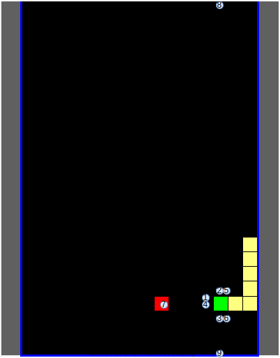
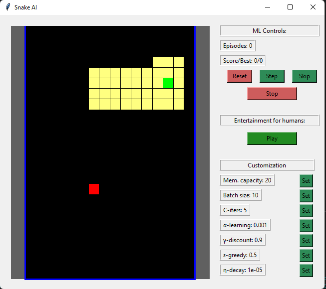

# Reporte
* Estudiante: Juan Jose Valverde Campos
* Carnet: B47200
* Laboratorio 8 - Deep Q-Learning 
* Profesor: Pablo Sauma Chacón

# Cambios realizados

Como cambios al estado inicial recibido, se modificó el mismo. Esta decisión se tomó en base a un [artículo de la IEEE]( https://ieeexplore-ieee-org.ezproxy.sibdi.ucr.ac.cr/document/9480232), donde se encontró una forma de solución que reducía la dimensionalidad del problema con únicamente 9 variables. El mismo tiene mucho sentido pues explicaba que el juego de snake podemos visualizarlo como **sensores** que utilizan una serpiente para buscar su comida y donde los mismas que están *instalados* en su cabeza, provocando así un buen prototipo para iniciar con la idea de carros autónomos. 

En mi caso tome 6 de las 9 variables(sensores) que utilizaron en dicho estudio, donde agregué otros 3 que no vi en este estudio, teniendo así un total de 9 sensores. En este caso dichos sensores son estos en mi caso particular:

1. Determinación de peligro inmediato al frente de la cabeza de la serpiente (Sensor de la cabeza al frente)  
2. Determinación de peligro inmediato a la derecha de la cabeza de la serpiente (Sensor de la cabeza a la derecha)
3. Determinación de peligro inmediato a la izquierda de la cabeza de la serpiente (Sensor de la cabeza a la izquierda) [] 
4. Determinación de recompensa inmediata al frente de la cabeza de la serpiente (Sensor de la cabeza al frente)
5. Determinación de recompensa inmediata a la derecha de la cabeza de la serpiente (Sensor de la cabeza a la derecha)
6. Determinación de peligro/recompensa al frente de la cabeza de la serpiente (Sensor de la cabeza al frente) 
7. Determinación de peligro/recompensa al frente máximo de la cabeza de la serpiente (Sensor de la cabeza al frente)
8. Determinación de peligro/recompensa a la derecha máxima de la cabeza de la serpiente (Sensor de la cabeza a la derecha)
9. Determinación de recompensa inmediata a la izquierda máxima de la cabeza de la serpiente (Sensor de la cabeza a la izquierda)

* **Nota importante**: Se consideró que como acciones solo existirían 3 y no 4 movimientos. Esta circunstancia obedece a que la serpiente se ubica por su cabeza haciendo que la misma solo pueda hacer movimientos de doblar a la derecha o izquierda o mantener su posición. Esto provocó que tuviera que hacerse una salida especial donde tomará en consideración la dirección que seguía la serpiente como parte también del ambiente, sólo que esto no entraba directamente en la red neuronal (solo se pasa los valores mencionados y esto último se programó por aparte pues es más lógica de interacción agente y como se entiende una acción en el ambiente).

Finalmente para implementar la red neuronal y los aspectos relacionados a pytorch se utilizó el siguiente [recurso]( https://pytorch.org/tutorials/intermediate/reinforcement_q_learning.html), este permitió conocer como implementar la memoria en estos tipos de aprendizajes e incluso algunos tips para poder realizar el backpropagation en sólo una de las salidas (la salida elegida por la serpiente).

# Resultados Obtenidos 

Los mejores resultados obtenidos se obtuvieron con la siguiente combinación de hiperparámetros y con un total de 1000 simulaciones.

Por otra parte se utilizó la siguiente arquitectura de red neuronal (la misma se basó en lo que menciona el [artículo de la IEEE]( https://ieeexplore-ieee-org.ezproxy.sibdi.ucr.ac.cr/document/9480232) ) en cuanto a la cantidad de 100 neuronas y donde se utilizó tangente hiperbólica y leaky relu utilizando sus propiedades en el tratamiento respectivo para número negativos y donde dado que se buscaba valores de recompensa y castigo la última capa se optó por que no existiera función de activación:

**Nota**: Se pensó en utilizar drop out pero se terminó descartando.

Como detalle importante, es que se usaron sólo 1000 simulaciones, y estos hiperparámetros pues se uso como entrenamiento  un escenario más reducido (6x6), pues se consideró que la solución que se planteaba era una escalable y que se podía entrenar los sensores más fácilmente en escenarios pequeños. Este fue el resultado final

Con respecto al escenario propiamente del laboratorio se consiguió el siguiente resultado, observese como la solución por lo tanto sí es escalable a escenarios más grandes. *Observe*, como la serpiente se enrolló así misma.

# Reproducibilidad del modelo

Para reproducir el modelo es necesario únicamente que corra el programa base, se ha hecho una modificación en el archivo ML.Py donde en este se tiene todo lo relacionado al modelo implementado. Aquí se tiene tres variables constantes:

* *SAVEFILE*: Se refiere al nombre con el que se estará guardando el modelo por cada iteración.

* *LOADFILE*: Se refiere al nombre con el modelo que se estará iniciando el programa siempre y cuando la variable LOADMODE esté activado.

* *LOADMODE*: Se refiere a si se quiere cargar un modelo preentrenado (True) o si más bien se quiere empezar con un modelo completamente nuevo (False).

