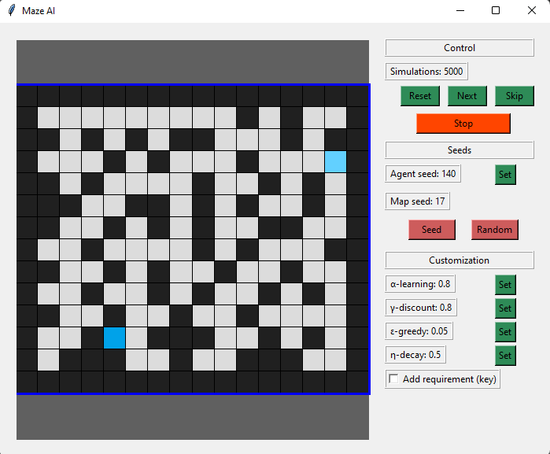

# Datos
* Estudiante: Juan Jose Valverde Campos
* Carnet: B47200
* Laboratorio 7 - Q-Learning
* Profesor: Pablo Sauma Chacón

# Aprendizaje

1. Mi mayor aprendizaje recayó en comprender que la tabla se debía de actualizar cada step que se iba haciendo, yo creía que se tenía que hacer cada vez que se terminaba una simulación, esto casi provoca que no pudiera tener el código correctamente. 

2. Con respecto a la fórmula de actualización de la tabla, yo no había comprendido la parte de Q(s,a) * (1-alpha). Por lo que completamente cambió mucho para mí entender que uno se veía afectado por el pasado y no solamente del moviento actual.

# Resultados Existosos

1. Map Seed = 17, Key = Off

2. Map Seed = 21, Key = On

3. Map Seed = 150, Key = On

# Notas Importantes
Yo realice el código pensando en que si el greedy es igual a 1, 
no ocurre ningún valor aleatorio, por lo que su forma de decaimiento se tenía que hacer de forma opuesta es decir 

    greedy *= (1+decay)